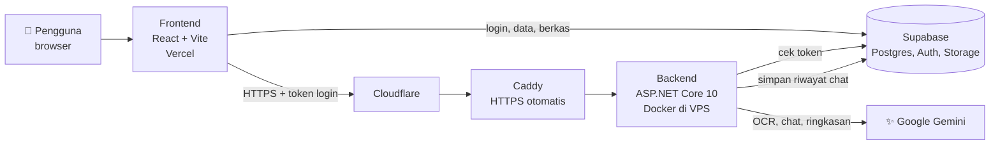

<div align="center">


# Hope.Ai

**Teman belajar berbasis AI untuk pelajar penyandang disabilitas.**

Foto bukunya, dengarkan isinya, tanya ke tutor AI, lalu latihan soal. Semua bisa diatur sesuai kebutuhan tiap orang.

[](https://hope-ai-nu.vercel.app)
[](https://api.bennedistus.web.id/health)
[](https://github.com/MuhammadHadistRifannan/Hope-AI/actions/workflows/ci.yml)


</div>

---

## 📚 Daftar isi

- [Kenalan dulu](#-kenalan-dulu)
- [Fitur](#-fitur)
- [Cara kerjanya](#-cara-kerjanya)
- [Setup di laptop sendiri](#-setup-di-laptop-sendiri)
- [Kalau ada yang error](#-kalau-ada-yang-error)
- [Isi repositori](#-isi-repositori)
- [Daftar API](#-daftar-api)
- [Keamanan](#-keamanan)
- [Deployment](#-deployment)
- [Cara pakai aplikasinya](#-cara-pakai-aplikasinya)

---

## 👋 Kenalan dulu

Banyak materi belajar masih berbentuk buku cetak dan tampilan yang seragam untuk semua orang. Buat pelajar tunanetra, low vision, tuli, atau disleksia, itu jadi penghalang sebelum belajarnya sendiri dimulai.

Hope.Ai mencoba membuka penghalang itu. Aplikasi ini bisa membacakan halaman buku, menjelaskan lewat tutor AI, menyediakan kamus isyarat, dan menyesuaikan tampilannya dengan kebutuhan penggunanya.

- 🎯 **Subtema**: Pendidikan
- 🌍 **SDGs**: nomor 4 (Pendidikan Berkualitas) dan nomor 10 (Berkurangnya Kesenjangan)
- 🏆 Dibuat untuk Web Development Competition UINIC 8.0 (2026)

---

## ✨ Fitur

| | Modul | Buat apa |
|---|---|---|
| 📷 | **EyeRead** | Foto halaman buku atau unggah gambar, lalu teksnya dibacakan dan bisa diringkas AI. Dari hasil pindai bisa langsung tanya tutor atau bikin kuis. |
| 🤖 | **NeoTutor** | Tutor AI yang bisa diajak ngobrol lewat ketikan atau suara. Bisa membahas satu materi atau dokumen tertentu, dan tiap percakapan diingat terpisah. |
| 📖 | **Flexa** | Materi tiga tingkat, kamus isyarat SIBI (gambar dan video), dan unggah dokumen sendiri (PDF, gambar, teks), lengkap dengan ringkasan AI. |
| 📝 | **Kuis adaptif** | AI menyusun soal dari materi atau dokumen apa pun. Tingkat soal naik kalau jawabanmu benar dan turun kalau salah. |
| 🔊 | **Suara AI** | Materi, hasil pindai, dan jawaban tutor dibacakan dengan suara natural. Kalau tidak tersedia, otomatis pakai suara perangkat. |
| 🗺️ | **Pathly** | Jalur belajar berlevel dengan kuis, XP, streak harian, sertifikat PDF, dan dua game latihan. |
| 💬 | **EchoForum** | Forum diskusi dengan komentar, suka, dan tombol untuk membacakan postingan. |
| ♿ | **Aksesibilitas** | Kontras tinggi, ukuran teks, huruf ramah disleksia, kecepatan suara, navigasi keyboard. Saat pertama masuk, pengguna memilih kebutuhannya dan tampilan langsung menyesuaikan. |
| 🛡️ | **Admin** | Statistik pemakaian, daftar pengguna, atur modul, dan moderasi forum. Khusus akun admin. |

---

## 🧩 Cara kerjanya



Singkatnya:

- **Frontend** ngobrol langsung dengan **Supabase** untuk login dan data.
- Semua yang butuh AI lewat **backend** dulu. Kunci API Gemini cuma ada di backend, jadi tidak pernah nyampe ke browser.
- Backend selalu mengecek token login sebelum mengerjakan apa pun.

| Bagian | Teknologi |
|---|---|
| Frontend | React 18, TypeScript, Vite, Tailwind CSS, shadcn/ui, Framer Motion |
| Backend | ASP.NET Core 10 (C#) |
| Database | Supabase (PostgreSQL) dengan Row Level Security |
| AI | Google Gemini 2.5 Flash (OCR, chat, ringkasan, kuis) dan Gemini TTS (suara) |
| Suara | Gemini TTS dengan cache di server, cadangan Web Speech API bawaan browser |
| Infrastruktur | Vercel, VPS + Docker Compose + Caddy, Cloudflare, GitHub Actions |

---

## 🚀 Setup di laptop sendiri

Santai, ikuti saja urutannya. Total sekitar 15–20 menit kalau semua alatnya sudah terpasang.

### 🧰 Yang perlu disiapkan

| Alat | Versi | Cek sudah terpasang atau belum |
|---|---|---|
| [Node.js](https://nodejs.org) | 20 ke atas | `node -v` |
| [.NET SDK](https://dotnet.microsoft.com/download) | 10 | `dotnet --version` |
| [Git](https://git-scm.com) | bebas | `git --version` |

Selain itu kamu butuh dua akun gratis:

- 🟢 **[Supabase](https://supabase.com)** untuk database dan login.
- 🔑 **[Google AI Studio](https://aistudio.google.com/apikey)** untuk kunci API Gemini.

### 1️⃣ Ambil kodenya

```bash
git clone https://github.com/MuhammadHadistRifannan/Hope-AI.git
cd Hope-AI
```

### 2️⃣ Siapkan database di Supabase

1. Buka [supabase.com](https://supabase.com), buat **project baru**, lalu tunggu sampai selesai dibuat.
2. Masuk ke menu **SQL Editor**.
3. Buka berkas `Frontend/supabase/migrations/20261005000000_hopeai_schema.sql`, salin semua isinya, tempel di SQL Editor, lalu klik **Run**. Ini membuat semua tabel dan aturan aksesnya.
4. Lakukan hal yang sama untuk `Frontend/supabase/seed.sql`. Ini mengisi data awal: modul, soal, materi, dan kamus isyarat.
5. Buka **Project Settings → API Keys**, lalu catat dua hal ini (nanti dipakai):
   - **Project URL**, contohnya `https://abcdefgh.supabase.co`
   - **Publishable key**, yang diawali `sb_publishable_`

> 💡 **Biar gampang saat mencoba:** secara bawaan Supabase mewajibkan konfirmasi email saat daftar. Kalau mau langsung bisa login tanpa cek email, matikan di **Authentication → Sign In / Providers → Email → Confirm email**.

### 3️⃣ Ambil kunci API Gemini

Buka [Google AI Studio](https://aistudio.google.com/apikey), klik **Create API key**, lalu salin kuncinya.

> ⚠️ Kunci ini rahasia. Jangan ditaruh di frontend, jangan di-commit, dan jangan dibagikan.

### 4️⃣ Jalankan backend

```bash
cd BE
cp appsettings.example.json appsettings.json
```

Buka `appsettings.json` lalu isi:

```json
{
  "APIKEY": "kunci-gemini-kamu",
  "Supabase": {
    "Url": "https://abcdefgh.supabase.co",
    "PublishableKey": "sb_publishable_xxx"
  },
  "Cors": {
    "AllowedOrigins": ["http://localhost:5173"]
  }
}
```

Lalu jalankan:

```bash
dotnet run --launch-profile http
```

Backend nyala di **http://localhost:5114**. Coba buka http://localhost:5114/health di browser. Kalau muncul `{"status":"ok"}`, berarti aman. ✅

### 5️⃣ Jalankan frontend

Buka **terminal baru** (yang backend biarkan tetap jalan):

```bash
cd Frontend
cp .env.example .env
```

Buka `.env` lalu isi:

```env
VITE_SUPABASE_PROJECT_ID="abcdefgh"
VITE_SUPABASE_URL="https://abcdefgh.supabase.co"
VITE_SUPABASE_PUBLISHABLE_KEY="sb_publishable_xxx"
VITE_API_URL="http://localhost:5114"
```

`VITE_SUPABASE_PROJECT_ID` itu bagian depan dari URL project kamu (sebelum `.supabase.co`).

Lalu:

```bash
npm install
npm run dev
```

Buka **http://localhost:5173**. 🎉

### 6️⃣ Daftar akun dan coba

1. Klik daftar, isi nama, email, dan kata sandi.
2. Konfirmasi lewat email (kecuali tadi sudah dimatikan).
3. Login. Akan muncul dialog untuk memilih kebutuhan belajar; pilih atau lewati.
4. Coba EyeRead dengan foto teks, lalu tanya sesuatu ke NeoTutor.

### 7️⃣ (Opsional) Jadikan akunmu admin

Supaya menu **Admin** muncul, jalankan ini di SQL Editor Supabase, ganti email-nya dengan email akunmu:

```sql
insert into public.user_roles (user_id, role)
select id, 'admin' from auth.users where email = 'email-kamu@contoh.com';
```

Lalu muat ulang aplikasinya.

---

## 🩹 Kalau ada yang error

| Gejalanya | Kemungkinan penyebab | Solusinya |
|---|---|---|
| Fitur AI bilang "terjadi kesalahan", di console browser ada tulisan **CORS** | Alamat frontend belum diizinkan backend | Pastikan `Cors:AllowedOrigins` di `appsettings.json` berisi `http://localhost:5173` persis, lalu jalankan ulang backend |
| Backend membalas **401** | Belum login, atau frontend dan backend memakai project Supabase yang berbeda | Login dulu. Cek URL Supabase di `.env` dan `appsettings.json` harus sama |
| Backend membalas **502** dengan pesan *API key not valid* | Kunci Gemini salah atau sudah dicabut | Buat kunci baru di AI Studio, ganti `APIKEY`, jalankan ulang backend |
| Sudah daftar tapi tidak bisa login | Email belum dikonfirmasi | Cek kotak masuk dan folder spam, atau matikan konfirmasi email (lihat langkah 2) |
| Halaman Pathly atau Flexa kosong | `seed.sql` belum dijalankan | Jalankan `seed.sql` di SQL Editor |
| Error *relation "…" does not exist* | Berkas skema belum dijalankan | Jalankan berkas migrasi di langkah 2 |
| `dotnet run` minta framework yang tidak ada | Versi .NET bukan 10 | Pasang .NET SDK 10 |
| Kamera tidak menyala di EyeRead | Izin kamera ditolak, atau dibuka bukan dari `localhost`/HTTPS | Izinkan kamera di browser. Kamera hanya bisa dipakai di `localhost` atau situs HTTPS |
| Input suara tidak jalan | Browser belum mendukung | Pakai Google Chrome atau Microsoft Edge |

---

## 📁 Isi repositori

```
Hope-AI/
├── Frontend/                  🎨 Aplikasi web (React)
│   ├── src/pages/             Halaman: EyeRead, NeoTutor, Flexa, Pathly, Forum, ...
│   ├── src/components/        Layout, dialog profil kebutuhan, komponen UI
│   ├── src/context/           Pengaturan aksesibilitas global
│   ├── src/hooks/             Hook bersama, termasuk peran pengguna
│   ├── src/lib/               Alamat backend, header login, helper aksesibilitas
│   ├── src/integrations/      Klien dan tipe Supabase
│   └── supabase/              Skema database dan data awal
├── BE/                        ⚙️ Backend (ASP.NET Core)
│   ├── Controllers/           Endpoint HTTP
│   ├── Services/              Gemini, OCR, riwayat chat
│   ├── Interfaces/            Kontrak service
│   └── Dockerfile
├── deploy/                    🐳 Docker Compose dan Caddy untuk VPS
└── .github/workflows/         🔁 Deploy otomatis backend
```

### 🗄️ Database

Ada 17 tabel, semuanya dijaga Row Level Security.

| Kelompok | Tabel |
|---|---|
| 👤 Akun | `profiles`, `user_roles`, `user_settings` |
| 🗺️ Pathly | `learning_modules`, `quiz_questions`, `module_progress`, `quiz_attempts`, `game_scores` |
| 📖 Flexa dan EyeRead | `materials`, `sign_items`, `user_documents` |
| 🤖 NeoTutor | `chat_sessions`, `chat_messages` |
| 💬 Forum | `forum_posts`, `forum_comments`, `forum_post_likes` |
| 🔔 Lainnya | `notifications` |

Begitu ada yang mendaftar, database otomatis membuatkan profil, pengaturan aksesibilitas, dan peran `student`. Kalau postingan forum dibalas, penulisnya otomatis dapat notifikasi.

---

## 🔌 Daftar API

Semua endpoint, kecuali `/health`, butuh header `Authorization: Bearer <token login Supabase>`.

Dokumentasi interaktifnya (Swagger) ada di **[api.bennedistus.web.id/docs](https://api.bennedistus.web.id/docs)**, atau `http://localhost:5114/docs` saat jalan di lokal.

| Metode dan jalur | Kirim apa | Dapat apa |
|---|---|---|
| `GET /health` | - | `{ "status": "ok" }` |
| `POST /gemini/chat` | JSON `{ "text", "sessionId"? }` | `{ "status", "response", "sessionId" }` |
| `POST /gemini/summary` | JSON `{ "text" }` | `{ "message" }` |
| `POST /gemini/simplify` | JSON `{ "text" }` | `{ "message", "truncated" }`, versi bahasa sederhana |
| `POST /gemini/quiz` | JSON `{ "text" }` | `{ "questions": [{ "q", "options", "a", "difficulty" }] }` |
| `POST /gemini/tts` | JSON `{ "text" }` (maks. 1.200 karakter) | audio WAV |
| `POST /scan/ocr` | form-data `image` (PNG, JPG, WEBP) | teks polos |
| `POST /scan/extract` | form-data `file` (PDF, PNG, JPG, TXT) | `{ "text" }` |

Arti kode status:

| Kode | Artinya |
|---|---|
| `400` | Masukan tidak valid (misalnya teks kosong) |
| `401` | Belum login atau token tidak sah |
| `404` | Sesi chat tidak ditemukan atau bukan milikmu |
| `413` | Berkas lebih dari 10 MB |
| `415` | Jenis berkas tidak didukung |
| `429` | Terlalu banyak permintaan (batas 30 per menit per pengguna), atau kuota suara AI sedang habis |
| `502` | Layanan AI sedang bermasalah |

---

## 🔒 Keamanan

- 🪪 **Login dicek sungguhan.** Backend memverifikasi tanda tangan token Supabase lewat JWKS, termasuk penerbit dan audiensnya.
- 🧱 **Data dijaga di database.** Row Level Security di setiap tabel: pengguna hanya bisa membaca dan mengubah datanya sendiri, materi hanya bisa diubah guru dan admin, dan yang belum login tidak bisa mengakses apa pun.
- 👮 **Peran tidak bisa diubah sendiri.** Peran disimpan di tabel terpisah, dan dicek oleh fungsi yang tidak terbuka lewat API.
- 🗂️ **Percakapan tidak bisa tercampur.** Backend tidak menyimpan riwayat chat di memori. Riwayat dibaca dari database memakai token milik pengguna itu sendiri.
- ✅ **Masukan divalidasi.** Ada batas panjang teks, batas ukuran berkas, dan daftar jenis berkas yang diizinkan.
- 🚧 **Pembatas lain:** CORS hanya untuk alamat frontend, rate limiting per pengguna, dan HTTPS di seluruh jalur.
- 🤫 **Rahasia tetap rahasia.** Kunci Gemini hanya ada di variabel lingkungan server. Tidak ada di repositori maupun di kode yang diunduh browser.

---

## 🚢 Deployment

| Bagian | Di mana | Cara update |
|---|---|---|
| 🎨 Frontend | Vercel | Otomatis setiap push ke `main` |
| ⚙️ Backend | VPS (Docker Compose + Caddy) | Otomatis lewat [GitHub Actions](.github/workflows/backend.yml) saat `BE/` atau `deploy/` berubah |
| 🗄️ Database | Supabase | Jalankan berkas migrasi di SQL Editor |

Alur deploy backend: build image Docker → kirim ke GitHub Container Registry → masuk ke VPS lewat SSH → jalankan ulang layanan → cek `/health`. Sertifikat HTTPS diurus Caddy secara otomatis.

Konfigurasi server ada di `/opt/hopeai/.env`. Contoh isinya ada di [`deploy/.env.example`](deploy/.env.example).

---

## 🎓 Cara pakai aplikasinya

1. 📝 **Daftar dan masuk** pakai email.
2. ♿ **Pilih kebutuhanmu** di dialog pertama, atau atur sendiri di menu Pengaturan: kontras tinggi, ukuran teks, huruf ramah disleksia, kecepatan suara. Jangan lupa tekan Simpan.
3. 📷 **Baca buku cetak**: buka EyeRead, arahkan kamera ke halaman atau unggah fotonya, lalu pilih Teks, Audio, atau Ringkasan.
4. 🤖 **Tanya tutor**: buka NeoTutor, ketik atau tekan tombol mikrofon. Pakai "Percakapan Baru" untuk topik lain; percakapan lama bisa dibuka lagi dari daftar.
5. 📖 **Belajar dari materi**: buka Flexa, pilih tingkat dan bab, atau unggah dokumen sendiri. Dokumen yang pernah diunggah atau dipindai ada di "Dokumen Saya".
6. 🤟 **Belajar isyarat**: di Flexa, buka Kamus Digital Isyarat, pilih Abjad atau Angka.
7. 🗺️ **Latihan**: buka Pathly dan selesaikan level satu per satu. Sertifikat bisa diunduh setelah semua level tuntas.
8. 💬 **Diskusi**: buka EchoForum untuk bertanya atau membantu teman lain.

⌨️ **Tanpa mouse:** tekan `Tab` untuk berpindah antar tombol dan `Enter` untuk memilih. Tautan "Lompat ke konten utama" muncul saat `Tab` ditekan pertama kali di tiap halaman.

---

<div align="center">

Dibuat dengan 💜 untuk pendidikan yang bisa diakses semua orang.

</div>
